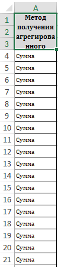

1. Скопировать полностью столбец из "большого" Эксель-файла.

2. Создать отдельный Эксель-файл для его использования в парсере.

3. Вставить в созданный Эксель-файл столбец так, чтобы не было ничего лишнего
Пример:
 так должно быть

4. Взять у созданного столбца название и вставить в парсер. 
столбец = `'имя_столбца'` - вот так

5. Запустить первую часть заметки, проверить вывод уникальных значений

6. Запустить следующую заметку и просто немного подождать

7. скопировать в этот запрос ```python sql = "INSERT INTO method_of_obtaining (Value) VALUES (%s)"``` название таблицы из БД.

8. Проверить, чтобы название столбца в БД было с МАЛЕНЬКОЙ буквы.

9. Запустить третью часть заметки.
